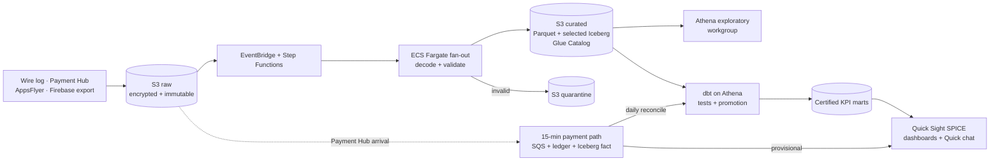

# Part 2: Scalable Game Analytics Architecture

## Recommendation and end-to-end design

Start with an AWS serverless lake: pre-launch traffic and daily reporting do not
justify an always-on warehouse. Keep raw data replayable and serving contracts
stable; change compute only when measured job time, query latency, concurrency,
or cost breaches an agreed service level.

All sources land in source/date/hour S3 prefixes; a scheduled job extracts the
Firebase/BigQuery export to Parquet and copies it into the same contract. S3
versioning, KMS encryption, lifecycle rules, and IAM/Lake Formation protect the
originals. EventBridge starts Step Functions; a Distributed Map fans out bounded
file batches to ephemeral Fargate tasks. Each task uses version-controlled
Protobuf descriptors to decode, validate, normalize UTC timestamps/IDs,
deduplicate, and write partitioned Parquet; bad records enter restricted
quarantine with reason codes. This is horizontal file-level scaling, not one
container processing 1 TB/day.

Glue Catalog exposes curated data to Athena. Append-only events start as simple
Parquet; selected mutable facts use Iceberg when corrections, deletes, atomic
publication, or partition evolution justify its compaction and snapshot
maintenance. A second Fargate task runs dbt Core on Athena, producing conformed
facts and small KPI marts. A manifest records checksums, row/reject counts,
schema/code versions, Iceberg snapshot where applicable, and `run_id`; reruns
are idempotent. Certified views advance only after blocking tests pass. Otherwise
users retain the last good version with visible `data_as_of` and freshness.

## Two analytical tiers and concurrency

| Tier | Intended use | Guarantee and access |
| --- | --- | --- |
| **Governed reporting** | Company KPIs, dashboards, and plain-language answers | Reviewed dbt definitions, daily freshness SLO, tests, lineage, ownership, and controlled promotion. Quick Sight imports only certified marts into SPICE and is shared through SSO and row-level security. |
| **Exploratory analytics** | Event investigation, fraud/exploit discovery, and prototyping | Athena reads curated events in a separate IAM workgroup. Data is schema-conformant but best-effort, with no KPI certification. Results become official only through dbt review, tests, and promotion. |

Both tiers reuse one landing zone, catalog, and pipeline—never one per analyst.
SPICE absorbs dashboard concurrency without rescanning S3. The exploratory
Athena workgroup has scan limits, budgets, timeouts, and CloudWatch metrics, so
ad-hoc work cannot delay reporting. If queues breach the SLO, reserve Athena
capacity first; use Redshift Serverless only if sustained concurrency or joins
still fail it.

## Governed plain-language queries

Use Amazon Quick Sight Topics with Amazon Quick chat, not a custom LLM service. Product
and Revenue Topics expose only certified marts and define approved terms,
joins, time semantics, aggregations, and non-additive rates. Existing permissions
and row-level security apply; the assistant cannot access raw/quarantine data,
write back, or redefine metrics.

Each numerical answer's Explanation shows dataset, filters, assumptions,
calculation, and generated SQL. Ambiguity triggers clarification. Owners maintain
verified common answers and a 15–20-question regression suite. CloudTrail/chat
logs audit identity and interaction; direct Athena queries also retain query IDs
and history. The displayed SQL remains the trace for SPICE-backed answers.

## Live payments versus daily reporting

A daily batch cannot meet 15–20 minutes, so Payment Hub's 15-minute S3 delivery
gets a narrow path. S3 arrival publishes through EventBridge to SQS with a
dead-letter queue. An idempotent micro-batch task validates schema,
amount/currency and records checksum plus transaction version in DynamoDB, then
uses Athena `MERGE INTO` to update a compact Iceberg payment fact. A narrow
Quick Sight direct-query aggregate is labelled **provisional** and displays
event/ingestion watermarks and stale-file alerts.

Daily processing remains authoritative: reload the partition, resolve late
changes, reconcile purchases/refunds/bookings to provider control totals, then
promote certified revenue through dbt. The fast path optimizes freshness and may
revise; daily optimizes completeness and correctness. If Iceberg merges or
direct queries breach the latency SLO, move only this fact/aggregate to Redshift
Serverless.

## Data quality and operations

Arrival controls detect missing, late, duplicate, empty, or checksum-mismatched
files. Decode controls reject unknown Protobuf versions and quarantine malformed
records. Curated/dbt checks cover types, required fields, timestamp order,
deduplication, grain, relationships, freshness, funnel/retention logic, and
source-to-mart reconciliation. Payment publication also requires unique versions,
valid currency/amount, linked refunds, and exact provider control totals.

CloudWatch alerts via SNS/PagerDuty on those failures, reject-rate drift, stale
watermarks, Quick Sight refreshes, and Athena limits. Each alert carries source,
partition, `run_id`, owner, and runbook. Bad partitions remain quarantined;
consumers see last-good data and a staleness warning during idempotent backfill.

## Cost, evolution triggers, and deliberate scope

Pre-launch cost is S3 storage/requests, short Fargate runs, Athena bytes scanned,
SPICE, and licences. Parquet compression, partition pruning, compaction,
lifecycle tiering, workgroup limits, and cached marts control it. At 1 TB/day,
retained raw data, distributed decoding, wide scans/backfills, and direct-query
concurrency dominate.

Evolution is evidence-led:

- Replace Fargate decoding with hourly Glue Spark if p95 processing exceeds its
  input window, memory limits are reached, or two partitions remain backlogged.
- Add Iceberg only where corrections, deletes, schema/partition evolution, or
  cross-partition backfills make append-only Parquet operationally fragile.
- Reserve Athena capacity for sustained queues; adopt Redshift Serverless when
  tuned direct queries repeatedly miss the agreed p95 latency or three-month
  Athena spend approaches the modelled warehouse cost.
- Move live payments first if p95 end-to-end freshness exceeds 15 minutes or
  any normal operating period breaches the 20-minute commitment.

Initially do **not** build gameplay streaming/Kinesis, a raw-event warehouse,
universal Iceberg, custom AI, ML/fraud systems, multi-cloud, or multi-region DR.
Daily gameplay KPIs and a 15-minute payment micro-batch meet the need; the rest
adds cost before evidence justifies it. IaC and CI/CD, separate dev/prod roles,
KMS encryption, pseudonymized player IDs, restricted quarantine, retention and
deletion policies, ownership, and runbooks remain the minimum safe foundation.
