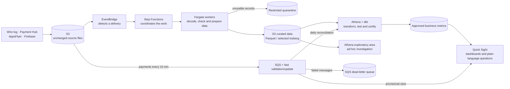

# Part 2 — Data Architecture Proposal

## 1. Recommendation and end-to-end architecture

Build a **governed AWS lakehouse that has no permanently running compute**. In
plain terms, data is kept cheaply in Amazon S3 and processing capacity is used
only when new data arrives or a report must be refreshed. This is appropriate
before launch, while leaving a clear path to production scale. The wire log,
Payment Hub, AppsFlyer and Firebase provide gameplay, revenue, acquisition and
app-health data respectively.

The main choices and reasons are:

- **Amazon S3 — the durable starting point.** It keeps the original deliveries
  unchanged as a recoverable audit trail and provides low-cost storage at both
  pre-launch and production volumes.
- **Amazon EventBridge — the trigger.** It notices that a new file or scheduled
  delivery is ready and starts the appropriate workflow. It does not process the
  data; it ensures work begins reliably.
- **AWS Step Functions — the workflow coordinator.** It records stages such as
  validation, transformation and publication, and handles ordering, retries and
  failure paths so operators can see what happened to a delivery.
- **ECS Fargate — temporary processing workers.** Fargate runs the project’s
  decoding and preparation code in short-lived containers, without managing
  servers. **Decoding** means turning Protocol Buffer bytes into readable fields
  such as event name, user and timestamp. **Preparation** means checking those
  fields, standardizing formats and time zones, removing exact duplicates, and
  writing Parquet files. Workers shut down after a delivery, so there is no
  idle-compute charge.
- **AWS Glue Data Catalog — the shared index.** It records where curated tables
  live and what columns they contain, allowing Athena, dbt and Quick Sight to
  work from the same definitions.
- **Athena — the query engine.** It reads curated files in S3 for exploration
  and for scheduled transformations, without requiring a permanently running
  database.
- **dbt on Athena — the governed modelling and test layer.** dbt turns prepared
  events into consistent business models, applies tests and documents KPI logic.
  Athena supplies execution; dbt supplies reviewable logic and promotion.
- **Amazon Quick Sight — the consumption layer.** It presents dashboards and
  plain-language questions using certified, semantically ready datasets. A
  business **mart** contains metrics shaped for a decision (such as daily
  retention); a **fact table** contains approved event or transaction detail for
  controlled drill-down. Quick Sight may use either, but never raw or quarantined
  data, so definitions stay consistent and answers trace to governed SQL.

## 2. Reliable ingestion, data quality and recovery

The platform takes responsibility once source data lands in S3. Each delivery
gets a deterministic run ID based on its source, path and checksum; an S3
manifest and Step Functions execution record its processing and publication
state. This is sufficient to make retries safe without a separate database at
the initial scale. The wire log is decoded from Protocol Buffers; AppsFlyer
supplies attribution, Firebase app/crash exports, and Payment Hub revenue.
Records are checked, standardized and written as Parquet. Apache Iceberg is
reserved for payments, where refunds and corrections require reliable updates.

Quality is checked throughout: Was the file delivered? Can it be decoded? Are
required fields present? Do counts reconcile? Are business rules and freshness
expectations met? Invalid records go to restricted quarantine with a reason.

Only a passing dataset becomes the new certified version. If a run fails,
stakeholders continue to see the last successful version together with a clear
`data as of` time. CloudWatch and SNS report successful publication and alert on
late files, failed checks or stale dashboards. Original files allow the affected
delivery to be corrected and replayed. S3 manifests, versioned output prefixes
and workflow history provide the audit trail. The [ingestion and validation annex](ingestion_validation_annex.md)
clarifies ownership.

## 3. Governed reporting, exploration and plain-language access

The same stored data supports two clearly separated uses:

- The **governed reporting tier** contains daily Revenue, Retention, Reg-to-Pay
  and FTUE metrics reviewed and tested in dbt. These are the figures used for
  company decisions. Quick Sight caches them in SPICE, so many people can open
  dashboards quickly without repeatedly scanning the source data.
- The **exploratory tier** lets analysts investigate detailed curated events in
  Athena—for example, suspected fraud. It passes structural checks but carries
  no certified KPI guarantee. A finding becomes official only after definition,
  tests and ownership are reviewed.

Both tiers use the same S3 data and Glue catalogue, so supporting more users
does not require duplicate pipelines or datasets. Separate Athena workgroups
provide permissions, spending limits and workload isolation; capacity is
reserved only if demand creates sustained queues.

For plain-language questions, Amazon Quick Sight Topics define approved terms,
joins and calculations for Quick chat. Permissions still apply and raw or
quarantined data is excluded. Users see the definition, freshness, assumptions
and generated SQL; ambiguity prompts clarification. Common questions are
regression-tested. If stricter control is needed, a thin Bedrock/Lambda service
can validate read-only SQL, restrict it to approved Athena views and audit the
question, user, query ID and dataset version.

## 4. Live payments

Daily reporting favours completeness and certification; the payments dashboard
favours speed. Every 15-minute Payment Hub delivery triggers a small processing
run, validates the transaction fields and updates an Iceberg payment table.
Quick Sight queries that table directly so revenue becomes visible within the
15–20 minute target. The dashboard clearly labels this view **provisional** and
shows when the source and dashboard were last updated.

The daily workflow later reconciles late bookings, refunds and corrections
before revenue is certified. If there is no separate daily file, the accumulated
15-minute deliveries are reconciled and certified by that workflow. Amazon SQS
holds work safely during short disruptions; repeatedly failed items move to its
dead-letter queue. A FIFO/order-by-delivery policy and transaction IDs in the
Iceberg `MERGE` prevent overlapping deliveries from creating duplicate payments.
The daily quality checks, audit history and alerts still apply.

## 5. Cost, scaling and deliberate scope

Before launch, costs are mainly S3 storage, Athena scans, Quick Sight licences
and caching, and short processing runs. Partitioned files, cached KPIs,
lifecycle rules and query limits control spend. There is no always-on warehouse.

Change only on evidence: move decoding and file maintenance to Glue Spark when
jobs miss their window or hit memory limits; reserve Athena capacity for queues;
and use Redshift Serverless when repeated latency or three-month Athena cost is
worse than the warehouse alternative. Move live payments first if they miss 20
minutes. Add a DynamoDB control ledger later if concurrent retries, backfills or
the need for searchable long-term run history make S3 manifests and workflow
history cumbersome.

Initially, build the shared S3 foundation, reliable processing, two analytics
tiers, certified KPI dashboards, controlled natural-language access and the
15-minute payment path. Intentionally do **not** build gameplay streaming with
Kafka/Kinesis, duplicate lakes, an always-on warehouse, a custom AI assistant,
universal Iceberg, a general-purpose chatbot or autonomous AI agent,
machine-learning infrastructure, multi-cloud or multi-region recovery. These
add cost and risk without improving the required decisions or payment visibility.
Reconsider them only when an observed need justifies them.
