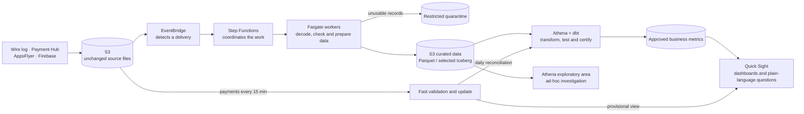

# Part 2 — Data Architecture Proposal

## 1. Recommendation and end-to-end architecture

Build a **governed AWS lakehouse that has no permanently running compute**. In
plain terms, data is kept cheaply in Amazon S3 and processing capacity is used
only when new data arrives or a report must be refreshed. This is appropriate
before launch, while leaving a clear path to production scale. The wire log,
Payment Hub, AppsFlyer and Firebase provide gameplay, revenue, acquisition and
app-health data respectively.

The main choices and reasons are:

- **S3** keeps the original files as a recoverable audit trail and provides
  low-cost storage at both pre-launch and production volumes.
- **EventBridge** acts as the trigger when a delivery arrives; **Step Functions**
  is the coordinator that tracks each processing step, retry and failure; and
  temporary **ECS Fargate** workers perform the decoding and preparation. This
  combination scales without paying for idle servers.
- **Athena** queries data directly in S3, while **dbt** gives metric definitions,
  transformations and quality tests a reviewed, version-controlled home.
- **Quick Sight** makes dashboards widely accessible and supports an approved
  plain-language query experience without building a custom application.

## 2. Reliable ingestion, data quality and recovery

The platform takes responsibility once source data lands in S3. Each delivery
is registered so the same file cannot be counted twice. Wire logs are decoded
from Protocol Buffers; records are checked, standardized and converted to
efficient Parquet files. Apache Iceberg is reserved for data such as payments,
where refunds and corrections require reliable updates.

Quality is checked throughout: Was the file delivered? Can it be decoded? Are
required fields present? Do counts reconcile from source to report? Are business
rules and freshness expectations met? Invalid records are placed in a restricted
quarantine with a reason instead of corrupting a KPI.

Only a passing dataset becomes the new certified version. If a run fails,
stakeholders continue to see the last successful version together with a clear
`data as of` time. CloudWatch and SNS report successful publication and alert on
late files, failed checks or stale dashboards. Original files allow the affected
delivery to be corrected and replayed. A DynamoDB ledger provides the audit
history and prevents duplicate work. The [ingestion and validation annex](ingestion_validation_annex.md)
clarifies ownership.

## 3. Governed reporting, exploration and plain-language access

The same stored data supports two clearly separated uses:

- The **governed reporting tier** contains daily Revenue, Retention, Reg-to-Pay
  and FTUE metrics reviewed and tested in dbt. These are the figures used for
  company decisions. Quick Sight caches them in SPICE, so many people can open
  dashboards quickly without repeatedly scanning the source data.
- The **exploratory tier** lets analysts investigate detailed curated events in
  Athena—for example, suspected fraud. The data passes structural checks, but
  exploratory calculations carry no certified KPI guarantee. A finding becomes
  official only after its definition, tests and ownership are reviewed.

Both tiers use the same S3 data and Glue catalogue, so supporting more users
does not require duplicate pipelines or datasets. Separate Athena workgroups
provide permissions, spending limits and workload isolation. Athena capacity is
reserved only if growing demand creates sustained queues.

For plain-language questions, Amazon Quick Sight Topics define the approved
terms, joins and calculations that Amazon Quick chat may use. Existing user
permissions still apply, and raw or quarantined data is excluded. A user can
ask, “How many battles happened yesterday?” and see the definition, time period,
freshness, assumptions and generated SQL behind the answer. Ambiguous questions
prompt clarification, and common questions are tested against known answers.

## 4. Live payments

Daily reporting favours completeness and certification; the payments dashboard
favours speed. Every 15-minute Payment Hub delivery triggers a small processing
run, validates the transaction fields and updates an Iceberg payment table.
Quick Sight queries that table directly so revenue becomes visible within the
15–20 minute target. The dashboard clearly labels this view **provisional** and
shows when the source and dashboard were last updated.

The daily workflow later reconciles late bookings, refunds and corrections
before revenue is certified. If there is no separate daily file, the accumulated
15-minute deliveries are reconciled and certified by that workflow. Amazon SQS
holds work safely during short disruptions; repeatedly failed items move to its
dead-letter queue for investigation. The daily quality checks, audit history and
alerts still apply.

## 5. Cost, scaling and deliberate scope

Before launch, the main costs are S3 storage, the amount of data scanned by
Athena, Quick Sight licences and caching, and short processing runs. Partitioned
files, cached KPIs, storage lifecycle rules and query limits control these costs.
There is no always-on data warehouse.

Architecture changes are triggered by evidence: move large decoding and file
maintenance to Glue Spark when jobs miss their delivery window; reserve Athena
capacity for sustained queues; and use Redshift Serverless when repeated query
latency or three-month Athena cost is worse than the warehouse alternative.
Live payments move first if they repeatedly miss 20 minutes.

Initially, build the shared S3 foundation, reliable processing, two analytics
tiers, certified KPI dashboards, controlled natural-language access and the
15-minute payment path. Intentionally do **not** build gameplay streaming with
Kafka/Kinesis, duplicate lakes, an always-on warehouse, a custom AI assistant,
universal Iceberg, machine-learning infrastructure, multi-cloud or multi-region
recovery. These add cost and risk without improving the required decisions or
payment visibility. Reconsider them only when an observed need justifies them.
