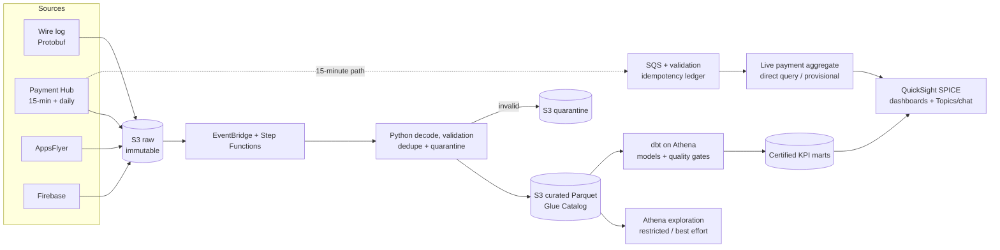

# Part 2: Scalable Game Analytics Architecture

## Recommendation

Start with a serverless AWS data lake, not a production-scale warehouse. The
platform should cost little at 20-100 daily active users (DAU), keep the same
interfaces at 10,000 DAU, and add distributed compute only when measured volume,
latency, or cost requires it. DAU is only a proxy: event bytes, file count,
processing time, retention, freshness, and analyst concurrency are the real
capacity drivers.

## From messy source data to trusted metrics

Original files remain encrypted and immutable in source/date/hour S3 prefixes.
The wire log is decoded using a version-controlled Protobuf schema; AppsFlyer
supplies attribution, Firebase supplies client/crash diagnostics, and Payment
Hub is the revenue authority. EventBridge starts scheduled work and Step
Functions exposes each stage, retry, and failure in one operational view.

At pre-launch scale, one containerized Python/dbt task validates arrivals,
normalizes identifiers and UTC timestamps, deduplicates events, and writes
partitioned Parquet. Invalid records go to restricted quarantine with reason
codes. The Glue Data Catalog makes those files queryable by Athena without a
running database. A shared `run_id` links manifests, logs, rejected counts, dbt
results, and the published version; reruns replace a source/date partition
idempotently.

dbt builds conformed facts and small KPI marts such as daily revenue, retention,
FTUE, and engagement. Each metric has an owner, grain, numerator, denominator,
time window, dimensions, source events, version, and freshness. Metric logic
lives in dbt, not dashboards. Stable certified views advance only after blocking
tests pass; otherwise users retain the last certified result with a visible
`data_as_of` timestamp and stale-data warning.

## Two analytical tiers

| Tier | Intended use and guarantee |
| --- | --- |
| **Governed reporting** | Reviewed dbt definitions, automated tests, daily freshness, controlled publication, lineage and ownership. Only certified marts feed company dashboards and the AI query experience. |
| **Exploratory analytics** | Restricted Athena workgroup over event-level curated data for investigations such as exploits or fraud. Quality is best effort; scan limits control cost, and results cannot be labelled official until promoted through dbt review and tests. |

Both tiers share the same landed and curated data. There is one governed model,
not a pipeline or dataset per analyst, dashboard, or team.

## Live payments versus daily reporting

The 15-20 minute target requires Payment Hub's 15-minute delivery; a daily feed
cannot meet it. Each S3 arrival enters SQS with a dead-letter queue. A small job
validates the file, checks an on-demand DynamoDB ingestion ledger for duplicate
object key/checksum combinations, and appends versioned transaction changes to
Parquet. An Athena view selects the latest transaction version and supplies a
narrow QuickSight direct-query aggregate. It shows event and ingestion
watermarks and is explicitly **provisional**.

The daily pipeline reprocesses the authoritative partition, reconciles
purchases, refunds, and bookings to Payment Hub control totals, and publishes
certified revenue. If append-only updates or direct-query latency become
inefficient, this ledger and the certified marts - never raw gameplay history -
move to Redshift Serverless.

## Quality, monitoring, and self-service

Controls reflect issues observed in Part 1 rather than a generic checklist:
source manifests and checksums catch missing/duplicate files; schema tests catch
unknown Protobuf versions; parsing tests quarantine malformed rows; normalization
handles mixed timestamps and identifiers; and dbt tests cover uniqueness,
relationships, freshness, event ordering, conditional funnel denominators,
retention windows, and source-to-target reconciliation. Payment tests require
unique transaction versions, linked refunds/bookings, valid amount/currency,
and exact daily control totals.

CloudWatch alerts on missing inputs, decode failures, unusual reject rates, dbt
failures, reconciliation differences, stale payments, failed QuickSight
refreshes, or Athena scan limits. The manifest and `run_id` trace incidents to
source files and support one documented source/date backfill procedure.

QuickSight imports certified daily marts into SPICE, its managed in-memory cache.
This gives readers fast filters without repeatedly scanning S3 or creating
consumer-specific datasets. Two Topics - Product and Revenue - add business
names, synonyms, relationships, and examples without redefining dbt metrics.
For plain-English questions, the Explanation exposes the dataset, filters,
assumptions, calculation, and generated SQL. A reviewed 15-20 question suite is
rerun when a Topic or mart changes; ambiguous questions request clarification.
This avoids operating a custom Bedrock application while preserving governed
access and SQL traceability.

## Cost, concurrency, and evolution

At 20-100 DAU, compute runs only during scheduled work; costs are S3 storage,
Athena scans, processing, and QuickSight licences. Moderate growth uses hourly
partitions, compression, pruning, compaction, workgroup limits, and SPICE.
Readers query cached marts, so concurrency does not multiply pipelines or data.

Approaching 1 TB/day, replace only the Python decode step with parallel hourly
Glue Spark jobs. Introduce Iceberg only for tables needing frequent corrections,
large cross-partition backfills, partition evolution, or time travel. Add
Redshift Serverless only when tuned marts still miss query SLOs, Athena scan cost
exceeds the modelled warehouse cost, direct-query queues persist, or payment
updates need efficient transactional merges. These are measured triggers, not
automatic consequences of DAU.

Initially exclude gameplay streaming/Kinesis, a raw-event warehouse, universal
Iceberg, a custom AI agent, ML/feature stores, automated fraud models,
multi-cloud, and multi-region disaster recovery. Production infrastructure
would use IaC and CI/CD, but implementing the platform is outside this proposal.
This deliberate scope keeps BAU ownership viable for a small SQL/Python/AWS team
without blocking later scale.
