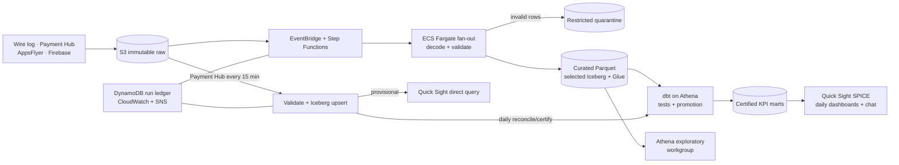

# Part 2 — Data Architecture Proposal

## 1. Recommendation and diagram

Build a **zero-idle governed lakehouse** on AWS. Source files remain immutable
in S3; short-lived containers decode and validate them; Athena and dbt create
certified metrics; and Quick Sight serves the company. A separate payment path
prioritizes 15-minute freshness. The design starts cheaply and changes compute
only when measured volume, latency, concurrency, or cost requires it.

## 2. Ingestion, publication and recovery

Sources land under `source/date/hour` S3 prefixes. Wire logs retain their
Protobuf bytes and schema version for historical decoding. AppsFlyer becomes
install/campaign dimensions, late attribution reprocesses affected dates, and a
scheduled extraction copies Firebase/BigQuery exports to S3. Payment Hub feeds
both live and daily workflows.

EventBridge starts Step Functions; Distributed Map sends bounded batches to
ephemeral Fargate tasks rather than one container processing 1 TB/day. Tasks
validate fields, normalize UTC timestamps/IDs, deduplicate, and write partitioned
Parquet. Iceberg is reserved for facts requiring corrections, deletes, atomic
updates, or partition evolution. A DynamoDB ledger keyed by source, checksum,
and processing version makes retries idempotent; Terraform and CI/CD version the
platform.

Arrival checks detect missing, late, duplicate, empty, or checksum-mismatched
files. Decode checks reject unknown Protobuf versions and quarantine malformed
records with reason codes. dbt tests required fields, uniqueness, relationships,
grain, freshness, business logic, and source-to-mart reconciliation. A manifest
records counts, code/schema versions, `run_id`, and applicable Iceberg snapshot.

Only a passing version advances certified views; failure retains the last good
version with visible `data_as_of`. CloudWatch and SNS report success, warning,
failure, stale watermarks, reject-rate drift, dbt/Quick Sight failures, and
Athena limits. Alerts identify source, partition, `run_id`, owner, and runbook.
Immutable inputs allow correction and replay of only the affected object.
The supporting [ingestion and validation annex](ingestion_validation_annex.md)
defines the source-owner, platform, and analytics responsibility split.

## 3. Governed reporting, exploration and plain-language access

The **governed tier** contains reviewed dbt definitions and certified daily KPI
marts. Quick Sight imports them into SPICE, giving concurrent readers fast,
shareable dashboards without rescanning S3. IAM Identity Center, Lake Formation,
encryption, pseudonymous IDs, row-level security, and dataset permissions protect
data. Metric logic remains in dbt, not charts.

The **exploratory tier** exposes curated events through a separate Athena
workgroup for fraud, exploit, and ad-hoc analysis. It is schema-conformant but
best effort, with scan limits, timeouts, and budget alarms. Results become
official only after dbt review, testing, and promotion. Both tiers share S3 and
Glue; sustained queues can receive reserved Athena capacity without duplicate
data or pipelines.

Quick Sight Topics with Quick chat expose only certified marts and approved
terms, joins, time semantics, and rates. Existing permissions apply; chat cannot
read raw/quarantine data, write, or redefine metrics. Answers show definition,
denominator, freshness, and generated SQL. Ambiguity triggers clarification, and
common questions are regression-tested against canonical answers.

## 4. Live payments

Each 15-minute Payment Hub arrival passes through EventBridge and SQS with a
dead-letter queue. An idempotent micro-batch validates transaction fields,
records checksum/version in DynamoDB, and uses Athena `MERGE INTO` to update an
Iceberg payment fact. Quick Sight direct query avoids the daily SPICE wait; the
dashboard labels results **provisional** and shows event/ingestion watermarks.

The 15-minute deliveries provide the provisional operational view. When a daily
delivery is available, it reconciles late bookings, refunds, and corrections
before certified revenue is promoted. Otherwise, the accumulated Payment Hub
deliveries remain the source of truth and are reconciled and certified through
the scheduled daily workflow. Arrival, validation, publication, and dashboard
latency are monitored separately. Repeated 15–20-minute SLA breaches move only
this fact and aggregate to Redshift Serverless.

## 5. Cost, scaling triggers and deliberate exclusions

Pre-launch costs are S3 storage and requests, Athena bytes scanned, Quick Sight
licensing/SPICE, and brief Fargate and Step Functions runs; there is no idle
warehouse. Columnar files, partition pruning, compaction, lifecycle tiering,
cached marts, and Athena workgroup limits control spend. At approximately
1 TB/day, retained raw data, distributed decoding, wide scans and backfills,
small-file maintenance, and direct-query concurrency become the main drivers.

Change the architecture only on evidence:

- Move decoding and compaction to hourly Glue Spark when p95 processing exceeds
  its input window, memory limits are reached, or two partitions remain queued.
- Expand Iceberg only when corrections, deletes, schema/partition evolution,
  concurrent writers, or cross-partition replay make Parquet fragile.
- Reserve Athena capacity for sustained queues; adopt Redshift Serverless when
  optimized queries repeatedly miss the agreed p95 latency or three-month
  Athena spend approaches the modeled warehouse cost.
- Move live payments first when p95 end-to-end freshness exceeds 15 minutes or
  normal operation breaches the 20-minute commitment.

Do not initially build gameplay streaming with Kafka/Kinesis, duplicate lakes,
an always-on warehouse, universal Iceberg, a custom AI service, ML/feature
stores, multi-cloud, or multi-region disaster recovery. They add cost and
failure modes without improving the required daily KPIs, exploration, or
15-minute payment view enough to justify them.
